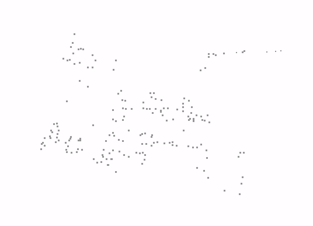
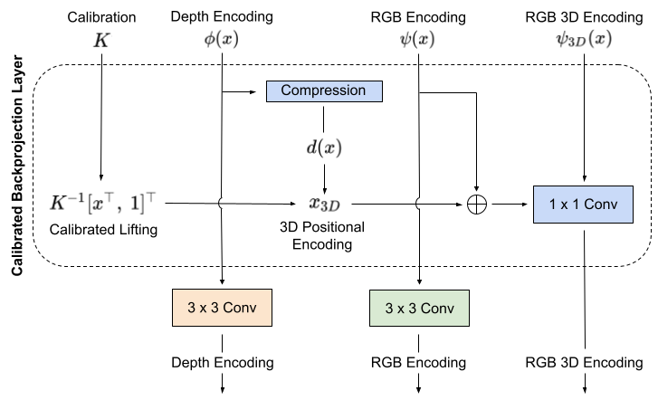

# Unsupervised Depth Completion with Calibrated Backprojection Layers

PyTorch implementation of *Unsupervised Depth Completion with Calibrated Backprojection Layers*

Published in ICCV 2021 (ORAL)

[[publication]](https://openaccess.thecvf.com/content/ICCV2021/papers/Wong_Unsupervised_Depth_Completion_With_Calibrated_Backprojection_Layers_ICCV_2021_paper.pdf) [[arxiv]](https://arxiv.org/pdf/2108.10531.pdf) [[poster]](figures/poster.pdf) [[talk]]()

Model have been tested on Ubuntu 16.04, 20.04 using Python 3.5, 3.6, 3.7 PyTorch 1.2, 1.3, (CUDA 10.1), 1.8.0, 1.8.1 (CUDA 11.1)

Authors: [Alex Wong](http://web.cs.ucla.edu/~alexw/)


If this work is useful to you, please cite our paper:
```
@inproceedings{wong2021unsupervised,
  title={Unsupervised Depth Completion with Calibrated Backprojection Layers},
  author={Wong, Alex and Soatto, Stefano},
  booktitle={Proceedings of the IEEE/CVF International Conference on Computer Vision},
  pages={12747--12756},
  year={2021}
}
```

**Table of Contents**
1. [About sparse to dense depth completion](#about-spare-to-dense)
2. [About Calibrated Backprojection Network](#about-calibrated-backprojection-network)
3. [Setting up](#setting-up)
4. [Downloading pretrained models](#downloading-pretrained-models)
5. [Running KBNet](#running-kbnet)
6. [Training KBNet](#training-kbnet)
7. [Related projects](#related-projects)
8. [License and disclaimer](#license-disclaimer)

## About sparse-to-dense depth completion <a name="about-sparse-to-dense"></a>
Given sparse point cloud and image, the goal is to infer the dense point cloud. The sparse point cloud can obtained either from computational methods such as SfM (Strcuture-from-Motion) or active sensors such as lidar or structured light sensors. Commonly, it is projected onto the image plane as a sparse depth map or 2.5D representation, in which case, methods in this domain predicts a dense depth map. Here are some examples of dense point clouds outputted by our method:


| *Image* | *Sparse Point Cloud* | *Output Point Cloud* |
| :-----: | :------------------: | :-----------------: |
|  |  |  |
|  |  |  |


To follow the literature and benchmarks for this task, you may visit:
[Awesome State of Depth Completion](https://github.com/alexklwong/awesome-state-of-depth-completion)


## About Calibrated Backprojection Network <a name="about-calibrated-backprojection-network"></a>

**The motivation:**

(1) In the scene above of the copyroom and outdoor bench, the point cloud produced by XIVO is on the order of hundreds of points. When projected onto the image plane as a 2.5D range map, the sparse points cover only 0.05% of the image space -- where typically only a single measurement will be present within a local neighborhood and in most cases, none. This not only hinders learning by rendering conventional convolutions ineffective, which will produce mostly zero activations, but also increases the sensitivity of the model to the variations in the range sensor and feature detector used to produce the point cloud.

(2) Typically the same sensor platform is used to collect the training set, so the model tends to overfit to the sensor setup. This is exacerbated in the unsupervised learning paradigm which leverages a photometric reconstruction loss as a supervisory signal. Because image reconstruction requires reprojection from one frame to another, this implicitly bakes in the intrinsic camera calibration parameters and limits generalization.

**Our solution:**

(1) To address the sparsity problem, we propose to project the point cloud onto the image plane as a sparse range map and learn a dense or quasi dense representation via a sparse to dense pooling (S2D) module. S2D performs min and max pooling with various kernel sizes to densify and capture the scene structure on multiple scales as in the figure below.

<p align="center">
    
</p>

There exists trade-offs between detail and density (more dense, less detail) and between preservation of near and far structures (min pool biases structures close to the camera, max pool biases structures far from the camera). These trade-offs are learned by three 1 by 1 convolutional layers and the resulting multi-scale depth features are fused back into the original sparse depth map to yield a dense or quasi-dense representation.

(2) To address the generalization problem, we propose to take an image, the projected sparse point cloud, and the calibration matrix as input. We introduce a calibrated backprojection layer or a KB layer that maps camera intrinsics, input image, and the imputed depth onto the 3D scene in a canonical frame of reference. This can be thought of as a form of spatial Euclidean positional encoding of the image.

<p align="center">
    
</p>

Calibration, therefore, can be changed depending on the camera used, allowing us to use different calibrations in training and test time, which significantly improves generalization.

Our network, Calibrated Backprojection Network (KBNet), goes counter to the current trend of learning everything with generic architectures like Transformers, including what we already know about basic Euclidean geometry. Our model has strong inductive bias in our KB layer, which incorporates the calibration matrix directly into the architecture to yield an RGB representation lifted into scene topology via 3D positional encoding.

<p align="center">
    
</p>

Not only do the design choices improve generalization across sensor platforms, by incorporating a basic geometric image formation model based on Euclidean transformations in 3D and central perspective projection onto 2D, we can reduce the model size while still achieving the state of the art.

To demonstrate the effectiveness of our method, we trained a model on the [VOID][void_github] dataset, which is captured by an Intel RealSense, and tested it on [NYU v2][nyu_v2_dataset], which is collected with a Microsoft Kinect.

<p align="center">
    
</p>

## Setting up your virtual environment <a name="setting-up"></a>
We will create a virtual environment with the necessary dependencies.

For Nvidia GTX 10 series (CUDA 10.1)
```
virtualenv -p /usr/bin/python3.7 kbnet-py37env
source kbnet-py37env/bin/activate
pip install opencv-python scipy scikit-learn scikit-image matplotlib gdown numpy gast Pillow pyyaml
pip install torch==1.3.0 torchvision==0.4.1 tensorboard==2.3.0
```

For Nvidia RTX 30 series (CUDA 11.1)
```
virtualenv -p /usr/bin/python3.7 kbnet-py37env
source kbnet-py37env/bin/activate
pip install opencv-python scipy scikit-learn scikit-image matplotlib gdown numpy gast Pillow pyyaml
pip install torch==1.8.2+cu111 torchvision==0.9.2+cu111 -f https://download.pytorch.org/whl/lts/1.8/torch_lts.html
pip install tensorboard==2.3.0
```

Note that there are some incompatibilities where PyTorch 1.5.0 - 1.7.1 does not reproduce the training results.
This seems to be fixed in PyTorch 1.8.0, so we recommend for the above virtual environment configurations.

## Setting up your datasets
For datasets, we will use [KITTI][kitti_dataset] for outdoors and [VOID][void_github] for indoors. We will also use [NYUv2][nyu_v2_dataset] to demonstrate our generalization capabilities.
```
mkdir data
ln -s /path/to/kitti_raw_data data/
ln -s /path/to/kitti_depth_completion data/
ln -s /path/to/void_release data/
ln -s /path/to/nyu_v2 data/
```

In case you do not already have KITTI, NYUv2 and VOID datasets downloaded, we provide download scripts for them:
```
bash bash/setup_dataset_kitti.sh
bash bash/setup_dataset_nyu_v2.sh
bash bash/setup_dataset_nyu_v2_raw.sh
bash bash/setup_dataset_void.sh
```

For the KITTI dataset, the `bash/setup_dataset_nyu_v2.sh` script will download and set up `kitti_raw_data` and `kitti_depth_completion` for you in your data folder.

For the NYUv2 dataset, the `bash/setup_dataset_nyu_v2.sh` script downloads the NYUv2 dataset using gdown.
As a workaround, you may download it via:
```
https://drive.google.com/open?id=1E5NgaEE8zEr4OizVcxc3nfQGfjSatUjX
```

The zip file is already preprocessed with image and depth frames aligned and synchronized. Alternatively you may want to download the raw data using `bash/setup_dataset_nyu_v2.sh`, but will need to process the frames using their MATLAB toolbox. We recommend the former.

The `bash/setup_dataset_nyu_v2.sh` script will download the `nyu_v2.zip` file and unzip it to the data directory.

For the VOID dataset, the `bash/setup_dataset_void.sh` script downloads the VOID dataset using gdown. However, similar to the above, gdown intermittently fails. As a workaround, you may download them via:
```
https://drive.google.com/open?id=1GGov8MaBKCEcJEXxY8qrh8Ldt2mErtWs
https://drive.google.com/open?id=1c3PxnOE0N8tgkvTgPbnUZXS6ekv7pd80
https://drive.google.com/open?id=14PdJggr2PVJ6uArm9IWlhSHO2y3Q658v
```
which will give you three files `void_150.zip`, `void_500.zip`, `void_1500.zip`.

Assuming you are in the root of the repository, to construct the same dataset structure as the setup script above:
```
mkdir void_release
unzip -o void_150.zip -d void_release/
unzip -o void_500.zip -d void_release/
unzip -o void_1500.zip -d void_release/
bash bash/setup_dataset_void.sh unpack-only
```

For more detailed instructions on downloading and using VOID and obtaining the raw rosbags, you may visit the [VOID][void_github] dataset webpage.

## Downloading our pretrained models <a name="downloading-pretrained-models"></a>
To use our pretrained models trained on KITTI and VOID models, you can download them from Google Drive
```
gdown https://drive.google.com/uc?id=1C2RHo6E_Q8TzXN_h-GjrojJk4FYzQfRT
unzip pretrained_models.zip
```

Note: `gdown` fails intermittently and complains about permission. If that happens, you may also download the models via:
```
https://drive.google.com/file/d/1C2RHo6E_Q8TzXN_h-GjrojJk4FYzQfRT/view?usp=sharing
```

Once you unzip the file, you will find a directory called `pretrained_models` containing the following file structure:
```
pretrained_models
|---- kitti
      |---- kbnet-kitti.pth
      |---- posenet-kitti.pth
|---- void
      |---- kbnet-void1500.pth
      |---- posenet-void1500.pth
```

We also provide our PoseNet model that was trained jointly with our Calibrated Backproject Network (KBNet) so that you may finetune on them without having to relearn pose from scratch.

The pretrained weights should reproduce the numbers we reported in our [paper](https://arxiv.org/pdf/2108.10531.pdf). The table below are the comprehensive numbers:

For KITTI:
| Evaluation set        | MAE    | RMSE    | iMAE  | iRMSE |
| :-------------------- | :----: | :-----: | :---: | :---: |
| Validation            | 260.44 | 1126.85 | 1.03  | 3.20  |
| Testing (online)      | 256.76 | 1069.47 | 1.02  | 2.95  |

For VOID:
| Evaluation set           | MAE    | RMSE    | iMAE  | iRMSE  |
| :----------------------- | :----: | :-----: | :---: | :----: |
| VOID 1500 (0.5% density) | 39.80  | 95.86   | 21.16 | 49.72  |
| VOID 500 (0.15% density) | 77.70  | 172.49  | 38.87 | 85.59  |
| VOID 150 (0.05% density) | 131.54 | 263.54  | 66.84 | 128.29 |
| NYU v2 (generalization)  | 117.18 | 218.67  | 23.01 | 47.96  |

## Running KBNet <a name="running-kbnet"></a>
To run our pretrained model on the KITTI validation set, you may use
```
bash bash/kitti/run_kbnet_kitti_validation.sh
```

Our run scripts will log all of the hyper-parameters used as well as the evaluation scores based on the `output_path` argument. The expected output should be:
```
Evaluation results:
     MAE      RMSE      iMAE     iRMSE
 260.447  1126.855     1.035     3.203
     +/-       +/-       +/-       +/-
  92.735   398.888     0.285     1.915
Total time: 13187.93 ms  Average time per sample: 15.19 ms
```

Our model runs fairly fast, the reported number in the paper is 16ms for KITTI images on an Nvidia 1080Ti GPU. The above is just slightly faster than the reported number.

To run our pretrained model on the KITTI test set, you may use
```
bash bash/kitti/run_kbnet_kitti_testing.sh
```

To get our numbers, you will need to submit the outputs to the KITTI online benchmark.

To run our pretrained model on the VOID 1500 test set of 0.5% density, you may use
```
bash bash/void/run_kbnet_void1500.sh
```

You should expect the output:
```
Evaluation results:
     MAE      RMSE      iMAE     iRMSE
  39.803    95.864    21.161    49.723
     +/-       +/-       +/-       +/-
  27.521    67.776    24.340    62.204
Total time: 10399.33 ms  Average time per sample: 13.00 ms
```

We note that for all of the following experiments, we will use our model trained on denser (VOID 1500) data and test them on various density levels.

Similar to the above, for the VOID 500 (0.15%) test set, you can run:
```
bash bash/void/run_kbnet_void500.sh
```

and the VOID 150 (0.05%) test set:
```
bash bash/void/run_kbnet_void150.sh
```

To use our model trained on VOID and test it on NYU v2:
```
bash bash/void/run_kbnet_nyu_v2.sh
```


## Training KBNet <a name="training-kbnet"></a>
To train KBNet on the KITTI dataset, you may run
```
bash bash/kitti/train_kbnet_vkitti.sh
```

To train KBNet on the VOID dataset, you may run
```
bash bash/void/train_kbnet_void1500.sh
```

Note that while we do not train on VOID 500 or 150 (hence no hyper-parameters are provided), if interested you may modify the training paths to train on VOID 500:
```
--train_image_path training/void/void_train_image_500.txt \
--train_sparse_depth_path training/voidvoid_train_sparse_depth_500.txt \
--train_intrinsics_path training/void/void_train_intrinsics_500.txt \
```

and on VOID 150:
```
--train_image_path training/void/void_train_image_150.txt \
--train_sparse_depth_path training/voidvoid_train_sparse_depth_150.txt \
--train_intrinsics_path training/void/void_train_intrinsics_150.txt \
```

To monitor your training progress, you may use Tensorboard
```
tensorboard --logdir trained_kbnet/kitti/kbnet_model
tensorboard --logdir trained_kbnet/void1500/kbnet_model
```

## Related projects <a name="related-projects"></a>
You may also find the following projects useful:

- [ScaffNet][scaffnet_github]: *Learning Topology from Synthetic Data for Unsupervised Depth Completion*. An unsupervised sparse-to-dense depth completion method that first learns a map from sparse geometry to an initial dense topology from synthetic data (where ground truth comes for free) and amends the initial estimation by validating against the image. This work is published in the Robotics and Automation Letters (RA-L) 2021 and the International Conference on Robotics and Automation (ICRA) 2021.
- [AdaFrame][adaframe_github]: *Learning Topology from Synthetic Data for Unsupervised Depth Completion*. An adaptive framework for learning unsupervised sparse-to-dense depth completion that balances data fidelity and regularization objectives based on model performance on the data. This work is published in the Robotics and Automation Letters (RA-L) 2021 and the International Conference on Robotics and Automation (ICRA) 2021.
- [VOICED][voiced_github]: *Unsupervised Depth Completion from Visual Inertial Odometry*. An unsupervised sparse-to-dense depth completion method, developed by the authors. The paper introduces Scaffolding for depth completion and a light-weight network to refine it. This work is published in the Robotics and Automation Letters (RA-L) 2020 and the International Conference on Robotics and Automation (ICRA) 2020.
- [VOID][void_github]: from *Unsupervised Depth Completion from Visual Inertial Odometry*. A dataset, developed by the authors, containing indoor and outdoor scenes with non-trivial 6 degrees of freedom. The dataset is published along with this work in the Robotics and Automation Letters (RA-L) 2020 and the International Conference on Robotics and Automation (ICRA) 2020.
- [XIVO][xivo_github]: The Visual-Inertial Odometry system developed at UCLA Vision Lab. This work is built on top of XIVO. The VOID dataset used by this work also leverages XIVO to obtain sparse points and camera poses.
- [GeoSup][geosup_github]: *Geo-Supervised Visual Depth Prediction*. A single image depth prediction method developed by the authors, published in the Robotics and Automation Letters (RA-L) 2019 and the International Conference on Robotics and Automation (ICRA) 2019. This work was awarded **Best Paper in Robot Vision** at ICRA 2019.
- [AdaReg][adareg_github]: *Bilateral Cyclic Constraint and Adaptive Regularization for Unsupervised Monocular Depth Prediction.* A single image depth prediction method that introduces adaptive regularization. This work was published in the proceedings of Conference on Computer Vision and Pattern Recognition (CVPR) 2019.

We also have works in adversarial attacks on depth estimation methods and medical image segmentation:
- [Stereopagnosia][stereopagnosia_github]: *Stereopagnosia: Fooling Stereo Networks with Adversarial Perturbations.* Adversarial perturbations for stereo depth estimation, published in the Proceedings of AAAI Conference on Artificial Intelligence (AAAI) 2021.
- [Targeted Attacks for Monodepth][targeted_attacks_monodepth_github]: *Targeted Adversarial Perturbations for Monocular Depth Prediction.* Targeted adversarial perturbations attacks for monocular depth estimation, published in the proceedings of Neural Information Processing Systems (NeurIPS) 2020.
- [SPiN][spin_github] : *Small Lesion Segmentation in Brain MRIs with Subpixel Embedding.* Subpixel architecture for segmenting ischemic stroke brain lesions in MRI images, published in the Proceedings of Medical Image Computing and Computer Assisted Intervention (MICCAI) Brain Lesion Workshop 2021 as an **oral paper**.

[kitti_dataset]: http://www.cvlibs.net/datasets/kitti/
[nyu_v2_dataset]: https://cs.nyu.edu/~silberman/datasets/nyu_depth_v2.html
[void_github]: https://github.com/alexklwong/void-dataset
[voiced_github]: https://github.com/alexklwong/unsupervised-depth-completion-visual-inertial-odometry
[scaffnet_github]: https://github.com/alexklwong/learning-topology-synthetic-data
[adaframe_github]: https://github.com/alexklwong/adaframe-depth-completion
[xivo_github]: https://github.com/ucla-vision/xivo
[geosup_github]: https://github.com/feixh/GeoSup
[adareg_github]: https://github.com/alexklwong/adareg-monodispnet
[stereopagnosia_github]: https://github.com/alexklwong/stereopagnosia
[targeted_attacks_monodepth_github]: https://github.com/alexklwong/targeted-adversarial-perturbations-monocular-depth
[spin_github]: https://github.com/alexklwong/subpixel-embedding-segmentation

## License and disclaimer <a name="license-disclaimer"></a>
This software is property of the UC Regents, and is provided free of charge for research purposes only. It comes with no warranties, expressed or implied, according to these [terms and conditions](license). For commercial use, please contact [UCLA TDG](https://tdg.ucla.edu).
